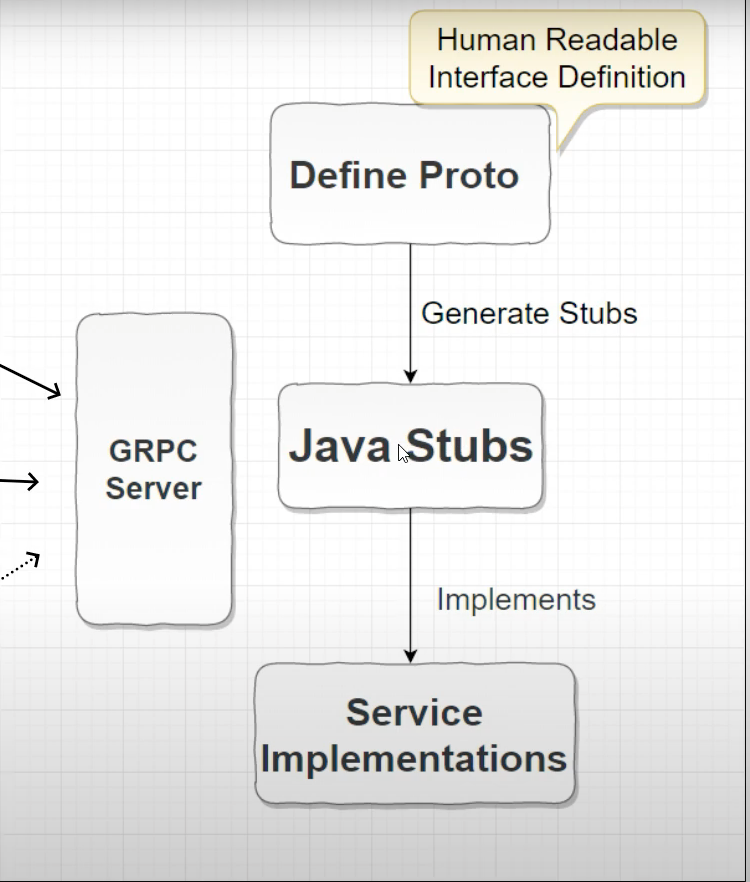

# gRPC Server

# Big Picture




## How to Set up

you will need to execute the command, it will pick default goal at maven 

1. ```mvn ```
2. go to com.bain.gprc.server and run main method


## What is Happening behind these command
 1. it compile the project and creates the stub service from user.proto
 2. user.proto is used to create service and client stubs both
 3. main method at com.bain.gprc.server run the grpc server at 9090 port

## how to Execute the service created
1. client is needed to execute the services , it cant be executed from browser or postman
2. install BloomRPC client to work start with ``` brew install --cask bloomrpc ```


## Proto Files
1. Files need to be shared with clients so that they can create stubs and call this service.

# Bloom RPC UI


